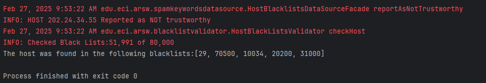

# Parcial_1_ARSW

### Andres Serrato Camero 

punto uno 

```java
package edu.eci.arsw.blacklistvalidator;

import java.util.LinkedList;

import edu.eci.arsw.spamkeywordsdatasource.HostBlacklistsDataSourceFacade;

import static edu.eci.arsw.blacklistvalidator.HostBlackListsValidator.ocurrencesCount;
import static edu.eci.arsw.blacklistvalidator.HostBlackListsValidator.blackListOcurrences;
import static edu.eci.arsw.blacklistvalidator.HostBlackListsValidator.checkedListsCount;

public class BlackListCheck extends Thread {

    private static final int BLACK_LIST_ALARM_COUNT = 5;


    private String ipaddress;
    private int start;

    private boolean isConfiable = true;


    public BlackListCheck(String ipaddress, int start) {

        this.ipaddress = ipaddress;

        this.start = start;

    }

    public boolean getisConfiable() {
        return isConfiable;
    }


    @Override
    public void run() {
        HostBlacklistsDataSourceFacade skds = HostBlacklistsDataSourceFacade.getInstance();


        for (int i = start; i < skds.getRegisteredServersCount() && ocurrencesCount < BLACK_LIST_ALARM_COUNT; i++) {
            checkedListsCount++;
//            System.out.println("holamundo estoy en un hilo ");


            if (skds.isInBlackListServer(i, ipaddress)) {

                blackListOcurrences.add(i);

                ocurrencesCount++;
            }

            if (ocurrencesCount < 5) {
                isConfiable = false;
            }
        }
//        if (ocurrencesCount >= BLACK_LIST_ALARM_COUNT) {
//            isConfiable = false;
//        } else {
//            isConfiable = true;
//        }
    }


}


```

punto 2 

añadir N cantidad de hilos

```java 
public static void main(String a[]){
    HostBlackListsValidator hblv=new HostBlackListsValidator();
    int N = 25; // esta es la cantidad de hiloscon los que se va a realizar la busqueda
    List<Integer> blackListOcurrences=hblv.checkHost("212.24.24.55",N);
    System.out.println("The host was found in the following blacklists:"+blackListOcurrences);

}

```


revisa añadir la cantidad de hilos y corre segun si es par o impart
```java 
        int cantidadListasArevisarPorHilo;
        HostBlacklistsDataSourceFacade skds = HostBlacklistsDataSourceFacade.getInstance();

        cantidadListasArevisarPorHilo = skds.getRegisteredServersCount() / N;

        for (int i = 0; i <= N; i++) {
            if (i == N &&!(N / 2 == 0) ) {
                int resta =  skds.getRegisteredServersCount() - cantidadListasArevisarPorHilo*N ;
                BlackListCheck black =  new BlackListCheck(ipaddress, (cantidadListasArevisarPorHilo * i) + resta);
                balcklists.add(black);
                black.start();
            } else {
                BlackListCheck black = (new BlackListCheck(ipaddress, cantidadListasArevisarPorHilo * i));
                balcklists.add(black);
                black.start();
            }
        }
```


punto 3

esta hecho pero no me da tiempo a agregar todo al readme  

bono 

